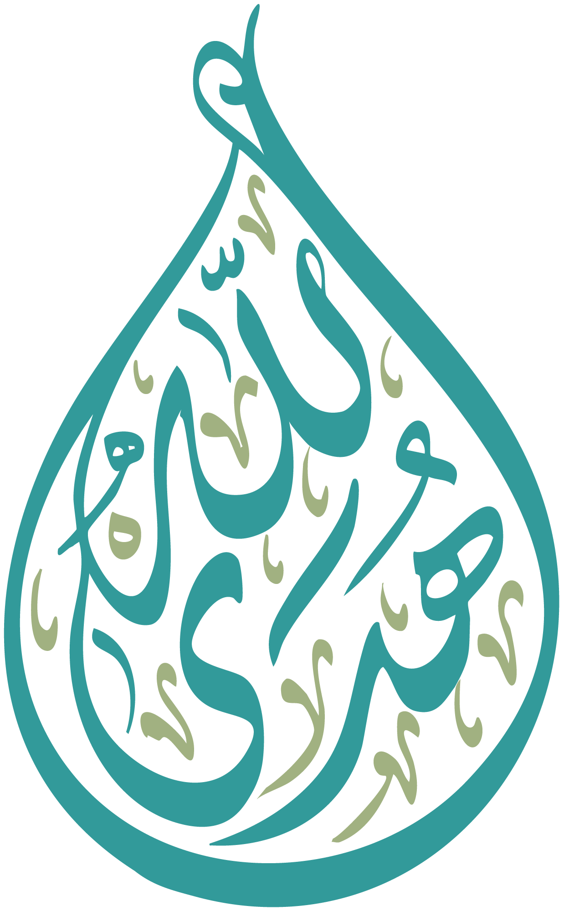

# هدى الله - Huda Allah System
<div align="center">
  
  <h3>نظام قرآني شامل - Comprehensive Quran System</h3>
  <p>تطبيق جوال + لوحة تحكم + واجهة برمجة تطبيقات</p>
</div>

---

## 📋 نظرة عامة | Overview

نظام "هدى الله" هو نظام قرآني شامل يتضمن:
- 📱 **تطبيق جوال** (Flutter) - لعرض القرآن والاستماع للتلاوات والمحاضرات
- 🖥️ **لوحة تحكم** (Next.js) - لإدارة المحتوى بالكامل
- 🔌 **واجهة برمجة تطبيقات** (NestJS) - لتقديم البيانات للتطبيقات

---

## 📊 إحصائيات قاعدة البيانات | Database Statistics

| الوحدة | العدد |
|--------|-------|
| السور | 114 |
| الآيات | 6,348 |
| الصفحات | 604 |
| الأجزاء | 30 |
| الأحزاب | 240 |
| القراء | 3 |
| التلاوات | 690 |
| توقيتات الآيات | 49,387 |
| المحاضرين | 8 |
| المحاضرات | 681 |
| الفقرات | 36,668 |
| الوسائط | 658 |
| الوسوم | 4,036 |

---

## 🏗️ هيكل المشروع | Project Structure

```
huda_allah_system/
├── apps/
│   ├── backend/          # NestJS Backend API
│   ├── mobile/           # Flutter Mobile App
│   └── admin/            # Next.js Admin Dashboard
├── packages/
│   ├── shared-types/     # TypeScript types
│   └── database/         # Database utilities
├── database/             # SQLite database
├── public/               # Static assets
│   ├── fonts/            # Quran fonts
│   └── images/           # Images and icons
└── prisma/               # Database schema
```

---

## 🚀 التشغيل السريع | Quick Start

### المتطلبات | Prerequisites
- Node.js 18+
- Flutter 3.19+
- Bun أو npm

### تشغيل لوحة التحكم | Run Admin Dashboard
```bash
# تثبيت التبعيات
bun install

# تشغيل الخادم
bun run dev
# أو
npm run dev
```

### تشغيل Backend | Run Backend API
```bash
cd apps/backend
npm install
npm run start:dev
```

### تشغيل تطبيق الجوال | Run Mobile App
```bash
cd apps/mobile
flutter pub get
flutter run
```

---

## 📱 الميزات الرئيسية | Main Features

### تطبيق الجوال | Mobile App
- ✅ عرض القرآن الكريم بخط عثماني
- ✅ التنقل بين السور والأجزاء والصفحات
- ✅ الاستماع للتلاوات بجودة عالية
- ✅ تصفح المحاضرات والدروس
- ✅ المفضلات ونقاط التوقف
- ✅ برامج القراءة والختمات
- ✅ البحث في القرآن والمحاضرات

### لوحة التحكم | Admin Dashboard
- ✅ إدارة السور والآيات
- ✅ إدارة القراء والتلاوات
- ✅ إدارة المحاضرين والمحاضرات
- ✅ إدارة الوسائط والألبومات
- ✅ إدارة برامج القراءة
- ✅ إحصائيات ونظرة عامة

### Backend API
- ✅ RESTful API كامل
- ✅ توثيق Swagger
- ✅ دعم RTL والعربية
- ✅ CORS enabled

---

## 🔌 API Endpoints

### القرآن | Quran
| Method | Endpoint | Description |
|--------|----------|-------------|
| GET | `/api/quran/surahs` | جميع السور |
| GET | `/api/quran/surahs/:id` | سورة بالمعرف |
| GET | `/api/quran/ayahs` | الآيات |
| GET | `/api/quran/pages` | الصفحات |
| GET | `/api/quran/juzs` | الأجزاء |
| GET | `/api/quran/hizbs` | الأحزاب |

### الصوتيات | Audio
| Method | Endpoint | Description |
|--------|----------|-------------|
| GET | `/api/audio/reciters` | القراء |
| GET | `/api/audio/recitations` | أنواع التلاوة |
| GET | `/api/audio/reciters/:id/audios` | ملفات القارئ |

### المحاضرات | Lectures
| Method | Endpoint | Description |
|--------|----------|-------------|
| GET | `/api/wiki/lectures` | المحاضرات |
| GET | `/api/wiki/lecturers` | المحاضرين |
| GET | `/api/wiki/albums` | الألبومات |
| GET | `/api/wiki/tags` | الوسوم |

---

## 🗄️ قاعدة البيانات | Database

### الجداول الرئيسية | Main Tables

**القرآن (Quran Tables):**
- `quran_surah` - السور
- `quran_ayah` - الآيات
- `quran_page` - الصفحات
- `quran_juz` - الأجزاء
- `quran_hizb` - الأحزاب
- `quran_glyph` - الرموز

**الصوتيات (Audio Tables):**
- `quran_reciter` - القراء
- `quran_recitation` - التلاوات
- `quran_recitertype` - أنواع القراء
- `quran_reciteraudio` - ملفات السور
- `quran_ayahaudio` - توقيتات الآيات

**المحتوى (Wiki Tables):**
- `quran_wiki_lecturer` - المحاضرين
- `quran_wiki_lecture` - المحاضرات
- `quran_wiki_paragraph` - الفقرات
- `quran_wiki_media` - الوسائط
- `quran_wiki_album` - الألبومات
- `quran_wiki_tag` - الوسوم

---

## 🎨 الخطوط | Fonts

| الخط | الاستخدام |
|------|----------|
| UthmanicHafs | نص المصحف |
| QCF_BSML | البسملة |
| ElMessiri | واجهة المستخدم |
| Newmalazim | أرقام الآيات |
| AbdoLine | الزخارف |

---

## 🐳 Docker

```bash
# بناء وتشغيل الكل
docker-compose up -d

# بناء فقط
docker-compose build

# إيقاف
docker-compose down
```

---

## 📁 الملفات المهمة | Important Files

```
├── db/huda_allah.db           # قاعدة البيانات
├── prisma/schema.prisma       # مخطط قاعدة البيانات
├── src/app/page.tsx           # صفحة لوحة التحكم
├── src/app/api/               # API routes
├── public/fonts/              # خطوط المصحف
└── public/images/             # الصور والأيقونات
```

---

## 🤝 المساهمة | Contributing

1. Fork المشروع
2. إنشاء فرع جديد (`git checkout -b feature/AmazingFeature`)
3. Commit التغييرات (`git commit -m 'Add some AmazingFeature'`)
4. Push للفرع (`git push origin feature/AmazingFeature`)
5. فتح Pull Request

---

## 📄 الترخيص | License

هذا المشروع لأغراض تعليمية وتطويرية.

---

## 🙏 الشكر | Acknowledgments

- المطور الأصلي: **تبصرة** (Tabsera)
- جميع القراء والمحاضرين

---

<div align="center">
  <p>صُنع بـ ❤️ للمجتمع الإسلامي</p>
  <p>Made with ❤️ for the Islamic community</p>
</div>
